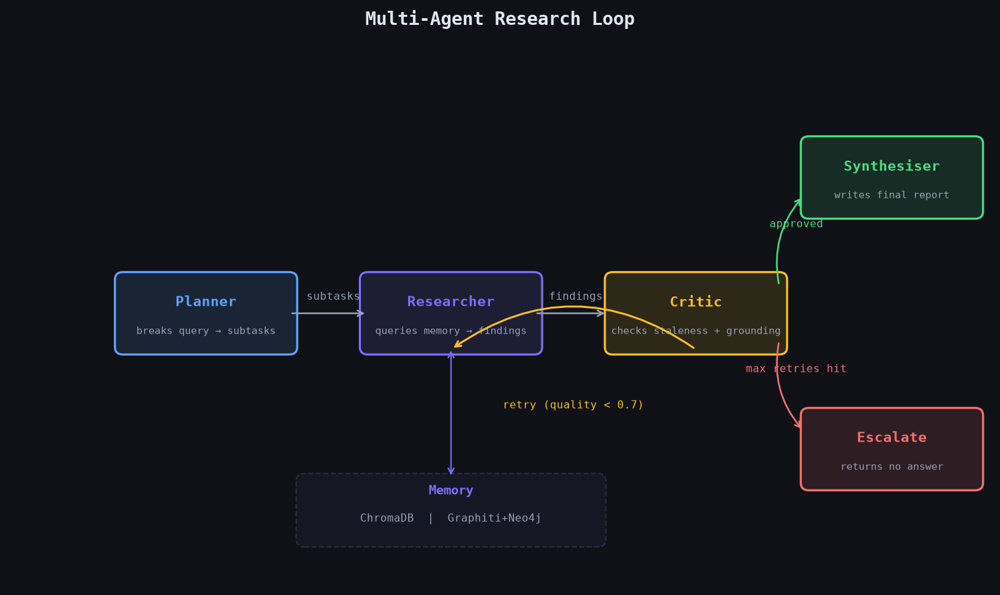
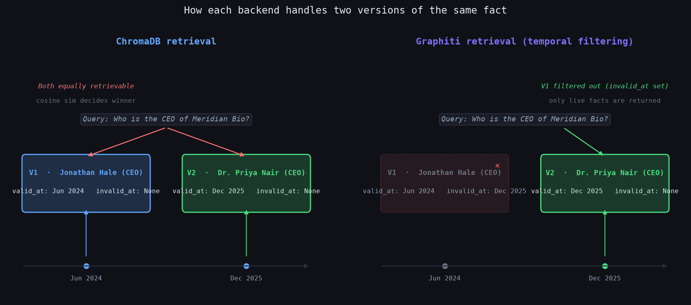
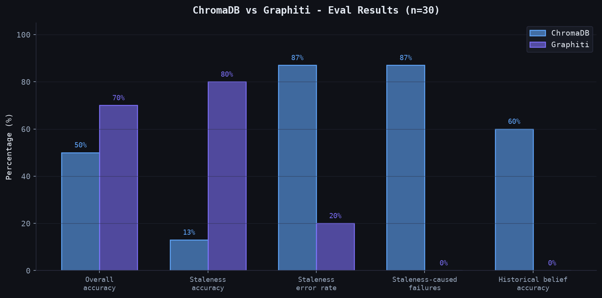
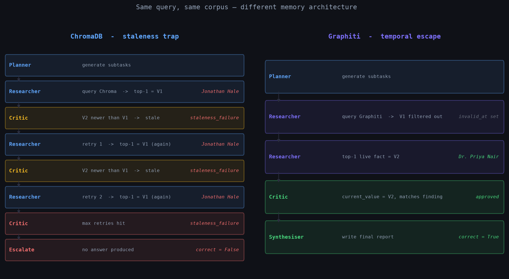

# Temporal Memory Architecture in Multi-Agent Systems: Benchmarking RAG vs Temporal Graphs on Staleness

*As multi-agent loop engineering matures, memory architecture becomes the critical failure point for most teams.*

Imagine a user's favourite movie changes. Interstellar gets dethroned by Inception. Both facts, the old favourite and the new, sit in the vector store. An agent queries for the current favourite. Similarity retrieval returns Interstellar, the outdated one. The critic agent flags it and triggers a retry. Same result. Retries again. Then escalates to a human, no answer produced.

That failure is the staleness problem in flat vector RAG. Embed documents, store in a vector store, retrieve by cosine similarity and it works for single-shot retrieval. Inside a loop, when two versions of the same fact coexist in memory, it breaks. The retriever has no concept of time and returns whatever scores highest on similarity, which is often the outdated fact.

An empirical A/B test of two memory architectures running the same 4-agent loop: ChromaDB (flat vector RAG, baseline) and Graphiti + Neo4j (temporal knowledge graph, treatment). Both back the same loop, with the same agents. Only the injected memory object differs.

---

## The loop

The system is a 4-agent research loop built in LangGraph. The loop takes a query, decomposes it into subtasks, retrieves facts from memory, validates them, and synthesizes a final report. If quality is below threshold, it retries. If it can't recover after two retries, it escalates.



**Loop engineering** here means the retry-escalate control structure. The critic scores findings on two dimensions: staleness (does a newer version of this fact exist?) and grounding (does the text support the claim?). If quality falls below 0.7, the loop sends the researcher back. If retries are exhausted, the loop escalates rather than hallucinate.

The agents are identical across both memory conditions. The planner breaks queries into 2-3 subtasks. The researcher queries memory and returns the top-1 hit per subtask. The critic checks each finding against `current_value(entity, relation)` for staleness, then runs an LLM grounding check. The synthesiser writes the final report from approved findings.

The **memory interface** is a single abstract class:

```python
class Memory(ABC):
    async def write(self, finding: Finding) -> None: ...
    async def query(self, query_text: str, k: int = 5) -> list[Finding]: ...
    async def current_value(self, entity: str, relation: str) -> Finding | None: ...
```

Two implementations, same interface. The loop never knows which backend it's talking to. That's the experimental seam.

---

## The eval harness

Measuring memory quality in a multi-agent loop requires more than accuracy on a benchmark. The eval harness tracks not just whether the answer is correct, but *why* it's wrong - specifically whether staleness caused the failure.

**Dataset: 30 queries across three types.**

**Static fact (n=10)** - one correct fact per query, no temporal element. Control group. Confirms the loop works before adding temporal complexity.

**Staleness-sensitive (n=15)** - two versions of a fact seeded into memory before each query. V1 is the older value (wrong answer for the query), V2 is the newer value (correct answer). Examples: a company's CEO changed, a fund changed its lead investor, a framework changed its default optimizer. The query asks for the current value.

**Historical belief (n=5)** - same two-version setup, but the query asks for the *past* state. The older fact is the correct answer. Designed to stress-test Graphiti's temporal invalidation in the direction where it's expected to fail.

The anti-cheat constraint governs all staleness items: V1 and V2 texts must be **indistinguishable without timestamps**. No recency words - "former," "previously," "outdated," "no longer" are all banned from corpus text. No explicit dates in the facts. Both V1 and V2 describe their fact as currently true. A reader encountering only one version would believe it. This ensures the temporal mechanism - not surface cues - is what determines retrieval outcome.

**Scoring tracks four metrics per query:**
- `correct` - ground truth appears in the final report
- `used_stale_fact` - stale V1 value appeared in the final report
- `critic_false_approve` - stale fact reached the report without being caught
- `staleness_caused_failure` - failure tagged with `staleness_failure` in the critic

Queries are isolated: each gets a fresh memory instance and a unique partition ID so facts from different queries never bleed into each other.

---

## How each backend handles stale facts

The mechanism comes down to what each memory layer sees when two versions of a fact exist.



In **ChromaDB**, both V1 (Jonathan Hale, CEO, Jun 2024) and V2 (Dr. Priya Nair, CEO, Dec 2025) sit in the vector store with no temporal metadata that affects retrieval. Both have `invalid_at: None` because ChromaDB has no such field. When the researcher queries "Who is the CEO of Meridian Bio?", cosine similarity decides. Because V1 and V2 are written in similar style and on the same topic (that's the anti-cheat guarantee), either could win. In practice, V1 consistently won the similarity contest in this eval, landing the researcher on the stale fact.

In **Graphiti**, when V2 is written, a Cypher query marks V1 with `invalid_at = V2.valid_at`. V1 is now superseded at the graph layer. The researcher's `query()` method filters to `invalid_at IS NULL` before returning results. V1 is invisible. The researcher gets V2 on the first retrieval.

The retrieval-layer difference is the entire story. The researcher doesn't need to be smarter. The critic doesn't need a better staleness check. The memory layer needs to stop returning stale facts.

---

## Results



```
+----------------------------------+--------------------+--------------------+
| Metric                           | ChromaDB           | Graphiti           |
+----------------------------------+--------------------+--------------------+
| Overall accuracy (30)            | 50%                | 70%                |
| Staleness accuracy (15)          | 13%                | 80%                |
| Staleness error rate (15)        | 87%                | 20%                |
| Staleness-caused failures (15)   | 87%                | 0%                 |
| Critic false-approve rate (15)   | 0%                 | 0%                 |
| Historical-belief accuracy (5)   | 60%                | 0%                 |
+----------------------------------+--------------------+--------------------+
```

**Staleness-sensitive queries:** Chroma got 2 of 15 correct (13%). Graphiti got 12 of 15 (80%). The difference is 67 percentage points.

**Staleness-caused failures:** Chroma produced a `staleness_failure` tag in 87% of staleness queries. Graphiti produced zero. Every Chroma failure traced to the same loop trap: detect staleness, retry, retrieve the same stale fact, retry again, escalate.

**Critic false-approve rate:** 0% for both. The critic never let a stale fact through to the final report. This matters because it means the Chroma failures were not false negatives in the critic - they were inescapable loops. The critic was doing its job. The retriever wasn't doing its job.

**Graphiti's 3 failures (20%):** All three were `retrieval_misalignment` escalations - the critic's LLM grounding check scored valid findings below 0.5, triggering unnecessary retries until escalation. These are noise from the 8B model used for agent LLM calls, not staleness system failures. Graphiti had zero findings where V1 made it into the final report.

**Historical belief:** Chroma 60%, Graphiti 0%. Discussed below.

---

## The failure trace

The failure trace for a staleness-sensitive query under Chroma vs Graphiti makes the mechanism concrete.



Chroma executes 8 steps to produce no answer. Graphiti executes 5 steps to produce the correct answer. The difference is entirely at the researcher's retrieval step - which fact gets returned from memory. Everything else in the loop is identical.

The failure mode is expensive in production. Staleness doesn't just produce wrong answers. It produces escalations where the loop burns its full retry budget, incurs the latency of all those LLM calls, and returns nothing. Average latency for staleness-sensitive queries in Chroma was 11,937ms. In Graphiti, 9,243ms, and most of that difference comes from the queries that escalated running three full researcher-critic cycles.

---

## The counter-finding: historical belief

The historical-belief subset is designed to expose the cost of temporal invalidation.

The queries ask about past state: "Who managed the Cascade Growth Fund when it had fewer than forty portfolio companies?" V1 is the correct answer (Thomas Aldrich, when the portfolio was smaller). V2 introduces a newer managing partner (Elena Vasquez, after the portfolio grew). The ground truth is V1.

Graphiti erases V1 when V2 is written. The researcher retrieves V2, the critic approves (it's not stale relative to anything in memory), the synthesiser writes the wrong name. 0 of 5 correct.

Chroma retrieves either V1 or V2 with roughly equal probability (both have similar similarity scores). 3 of 5 correct, essentially random.

A one-sided Graphiti win across all 30 queries would suggest the dataset was too easy. The historical-belief failure reveals a real tradeoff: temporal invalidation that works for "what is current?" actively works against "what was true before?" The right memory architecture depends on the question distribution the system needs to answer.

---

## Failure taxonomy

Across both conditions, three failure modes appeared:

**Staleness-induced escalation** (Chroma, 13/15 staleness queries) - researcher retrieves stale V1, critic flags it, retry retrieves V1 again, loop escalates. No stale fact reaches the report; the loop just produces nothing.

**Temporal overwrite failure** (Graphiti, 5/5 historical-belief queries) - V1 is marked invalid when V2 is written. Historical queries that need V1 retrieve V2 instead and produce the wrong answer.

**Retrieval misalignment** (Graphiti, 3/15 staleness queries; noise, not staleness) - the critic's LLM grounding check gives a false negative on a valid finding, triggering unnecessary retries until escalation. Not a memory architecture failure - a small-model failure.

---

## Caveats

**Sample size.** n=15 on the staleness subset is enough to observe a clear directional effect but not enough for strong statistical claims. The 67 percentage point gap is large, but treat the exact numbers as indicative.

**Manual invalidation vs native Graphiti.** Graphiti's `add_episode` method uses an internal LLM call for entity extraction. That call requires ~18K tokens per episode - more than the token-per-minute limit on any Groq free-tier model. `add_episode` was replaced with direct node and edge construction via `add_nodes_and_edges_bulk`, managing `invalid_at` with a Cypher query on write. The temporal semantics are preserved. Graphiti's LLM-driven entity resolution (which merges references to the same entity across different surface forms) is not used. The dataset uses exact-match entity strings across V1 and V2, so this doesn't affect results here.

**Agent LLM is 8B.** The planner, critic grounding check, and synthesiser all use `llama-3.1-8b-instant` via Groq free tier. The retrieval misalignment failures and some static-fact misses are 8B inconsistency. A stronger model would reduce noise.

**Synthetic corpus.** All facts use fabricated entities with clean entity-relation-value structure. The anti-cheat constraint keeps the staleness hard to detect without temporal metadata, which is the right property for this test. Real corpora are messier.

---

## Architecture implications

Flat vector RAG is the correct choice when:
- Facts in the domain are static or change infrequently
- Queries ask about a single point in time (usually "now")
- Simplicity and operational cost matter more than temporal precision

Temporal graph memory earns its complexity when:
- Facts change and the system needs to track what changed and when
- Queries ask "what is current?" for entities that have multiple versions in memory
- Loop-based architectures retry on failure - because flat RAG creates inescapable retry loops for stale facts

The third point is the one that gets missed. Temporal memory is often framed as a "knowledge base" improvement. It's actually a **loop engineering** improvement. Without it, a well-designed critic that correctly detects staleness makes the system *worse* - it burns retries on a problem the retriever can never solve.

Historical belief queries require a third option: a memory architecture that can query across time windows rather than always returning the live fact. Neither backend tested here handles this well. Graphiti overwrites. ChromaDB guesses randomly. The right answer is a retriever that can accept a temporal constraint as part of the query.

---

## Stack

Python, LangGraph, ChromaDB, Graphiti, Neo4j (Docker), Groq API (free tier), sentence-transformers for local embeddings.

Code: [github.com/n26modi/multi-agent-memory-eval](https://github.com/n26modi/multi-agent-memory-eval)
